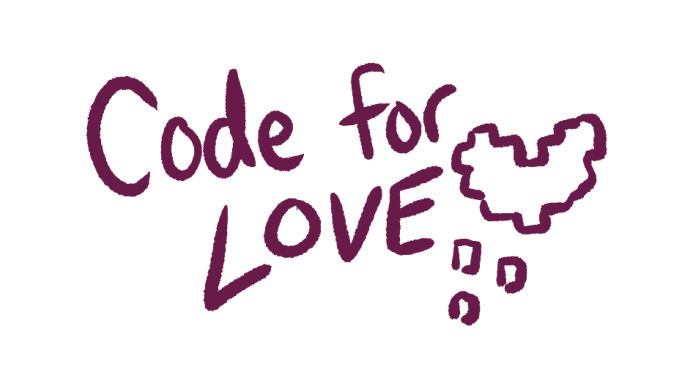

  

  

  # Code for Love

  ### [CLICK TO DEMO](https://mellygriffin.github.io/code-for-love-Project1/)

  ##### Melissa Griffin

  ## :hearts: Description

  Code for Love takes you on the journey to whoo your blind date who just happens to be a computer! Choose from conversation categories and do your best to impress your date by selecting your answers.

  

    ## Screenshots 

  |   Description | Screenshot | 
  |:-------------:| -----------|
  | <h3>Feed Page</h3> |  |